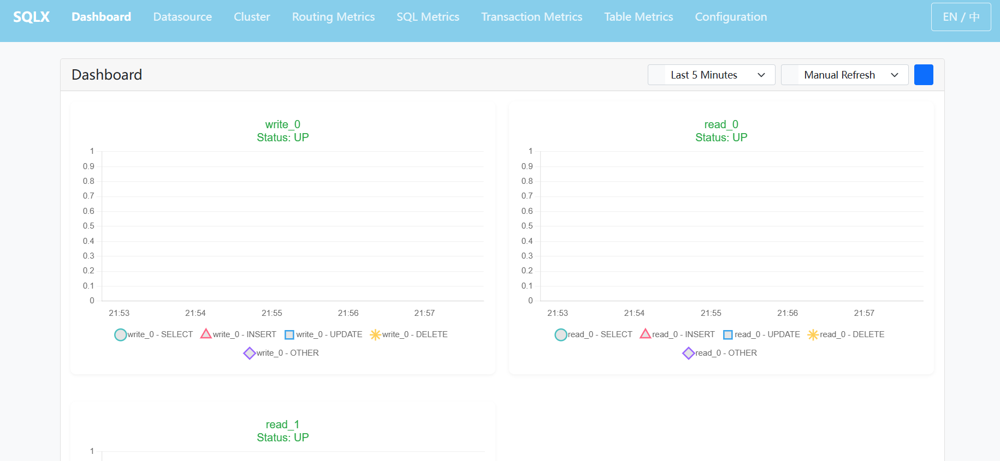

# 快速开始

本快速开始文档将指导您如何快速集成和使用 `sqlx-spring-boot-starter`，实现多数据源管理与智能 SQL 路由功能。

---

## 1. 环境准备

在开始之前，请确保您的开发环境满足以下要求：
- **Java 版本**: Java 8 或更高版本。
- **Spring Boot 版本**: Spring Boot 2.x。
- **依赖管理工具**: Maven 或 Gradle。

---

## 2. 引入依赖

将 `sqlx-spring-boot-starter` 添加到您的 Maven 项目中。在 `pom.xml` 文件中添加以下依赖：

```xml
<dependency>
    <groupId>com.github.sqlx</groupId>
    <artifactId>sqlx-spring-boot-starter</artifactId>
    <version>${version}</version>
</dependency>
```

如果您使用 Gradle，请在 `build.gradle` 中添加：

```gradle
implementation 'com.github.sqlx:sqlx-spring-boot-starter:${version}'
```

## 3. 添加 sqlx 配置

在 `application.yml` 或 `application.properties` 中添加 SQLX 配置：

```yaml
sqlx:
  enabled: true # 是否启用SQLX
  sql-parsing:
    sql-parsing-fail-behavior: warning # SQL解析失败时的行为，支持 WARNING (警告)、FAILING (报错)、IGNORE (忽略)
  metrics:
    enabled: true # 是否启用监控功能
    username: admin # 监控用户名
    password: adminpw # 监控密码
    collect-scope: SLOW # 监控采集范围, 支持 SLOW (只采集慢SQL和慢事务)、ALL (采集所有)
    enable-routing-metrics: true
    enable-sql-metrics: true
    enable-transaction-metrics: true
    slow-sql-millis: 300 # 慢 SQL 阈值，单位为毫秒
    slow-transaction-millis: 3000 # 慢事务阈值，单位为毫秒
    #      collect-mode: ASYNC # 采集方式，支持 SYNC (同步)、ASYNC (异步)
    #      collect-core-pool-size: 10
    #      collect-max-pool-size: 30
    #      collect-keep-alive-millis: 10000
    #      collect-queue-capacity: 3000
    file-directory: /usr/local/sqlx-metrics # 保存采集数据的文件目录
    data-retention-duration: 2h # 数据保留时长，支持 s、m、h、d、w、M、y
  data-sources: # 数据源配置
    - name: write_0 # 数据源名称需唯一
      weight: 99 # 数据源权重，用于负载均衡
      defaulted: true
      data-source-class: com.zaxxer.hikari.HikariDataSource
      init-method: init # 初始化方法
      destroy-method: close # 销毁方法
      init-sql-script: classpath:init.sql # 初始化 SQL 脚本
      props: # 数据源参数配置,参数名称和所使用的数据源字段名保持一致即可
        driverClassName: org.h2.Driver
        jdbcUrl: jdbc:h2:mem:~/test1;FILE_LOCK=SOCKET;DB_CLOSE_DELAY=-1;DB_CLOSE_ON_EXIT=TRUE;AUTO_RECONNECT=TRUE;IGNORECASE=TRUE;
        username: sa
        password: pwd
        minIdle: 5
        maxPoolSize: 30
        connectionTimeout: 30000
        isAutoCommit: false
        isReadOnly: false
    - name: read_0
      weight: 6
      data-source-class: com.zaxxer.hikari.HikariDataSource
      init-method: init
      destroy-method: close
      init-sql-script: classpath:init.sql
      props:
        driverClassName: org.h2.Driver
        jdbcUrl: jdbc:h2:mem:~/test2;FILE_LOCK=SOCKET;DB_CLOSE_DELAY=-1;DB_CLOSE_ON_EXIT=TRUE;AUTO_RECONNECT=TRUE;IGNORECASE=TRUE;
        username: sa
        password: pwd
        minIdle: 10
        maxPoolSize: 30
        connectionTimeout: 40000
        isAutoCommit: false
        isReadOnly: true
    - name: read_1
      weight: 10
      data-source-class: com.zaxxer.hikari.HikariDataSource
      init-method: init
      destroy-method: close
      init-sql-script: classpath:init.sql
      props:
        driverClassName: org.h2.Driver
        jdbcUrl: jdbc:h2:mem:~/test3;FILE_LOCK=SOCKET;DB_CLOSE_DELAY=-1;DB_CLOSE_ON_EXIT=TRUE;AUTO_RECONNECT=TRUE;IGNORECASE=TRUE;
        username: sa
        password: pwd
        minIdle: 15
        maxPoolSize: 30
        connectionTimeout: 60000
        isAutoCommit: false
        isReadOnly: true
  clusters: # 集群配置
    - name: cluster_0 # 集群名称需唯一
      defaulted: true # 当存在多个集群时指定是否是默认集群
      writable-nodes:
        - write_0
      readable-nodes:
        - read_0
        - read_1
        - write_0
    - name: cluster_1
      writable-nodes:
        - write_0
      readable-nodes:
        - read_1
  pointcuts: # SQL 路由切入点配置,该方法内的 SQL 会被路由到指定的集群和节点
    - expression: "execution(* com.foo.ServiceA.fun1())" # 切入点表达式，支持 Spring AOP 的切入点表达式
      cluster: cluster_0 # 集群名称
      nodes: # 节点名称
        - write_0
        - read_0
      propagation: true # 是否接受上层方法传播
    - expression: "execution(* com.foo.ServiceA.fun2())"
      cluster: cluster_0
      nodes:
        - write_0
        - read_0
        - read_1
      propagation: true
```

## 4. 启动项目

确保所有配置正确后，启动您的 Spring Boot 应用程序。您可以使用以下命令：

```bash
mvn spring-boot:run
```

或

```bash
./gradlew bootRun
```

## 5. 访问内嵌监控页面

在应用程序启动后，您可以通过访问 `http://{ip}:{port}/sqlx/index.html` 来查看 SQLX 的监控信息。

